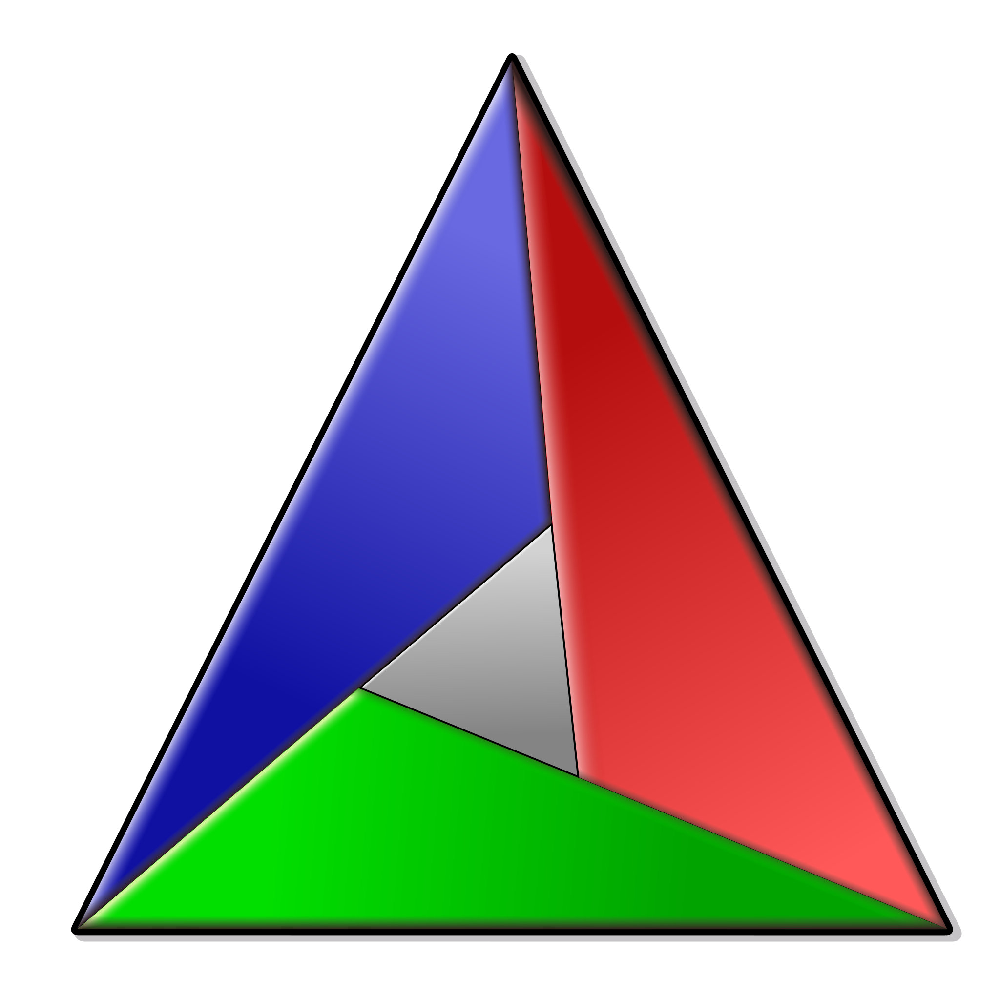

# C / C++

本篇簡介基礎概念。

主張：C 可以達成任何機器碼能夠達成的事，而且可以將**時間成本**或**程式體積**降到最低。

如其主張所示，C 語言幾乎可以達成任何應用（當然難度各有高低）。
有許多知名的方言如 Arduino、Cuda、Visual C++ 等；而許多程式語言也會先以 C 語言作為底層。

C++ 是由 C 語言延伸而來，擴充了更多較「抽象」的語法，以使其更容易開發。
通常 C 語言相容於 C++，但是仍有些許規則的不同。

有趣的是，由於它比較古老，很多為了相容舊版編譯器而導致出現奇怪的語法，
如關鍵字共用、很多簡寫（當時為了減少程式碼體積）、混亂的語法優先權等等。
相較於很多程式語言都是獨裁政權，C++ 是民主政府，歷年來的各種功能是投票決定的。

建議現在的版本使用 C++11 和 C++17，有較為貼近需求面的標準功能，
而且比較符合高階程式語言的寫作想像；若非必要，舊有的用法應該避免出現。

## Compiler

其實 C / C++ 都會和另一個程式語言共存，稱為「編譯器指令」。
它是一種直譯式語言，掌握 C / C++ 的生殺大權。
最大的特徵就是由 `#` 開頭，會看換行記號，主要功能是做**文字複製和替換**。
例如簡單的 `if` 語句就可以使整段程式碼被決定是否忽略。

```c
#ifdef COMPILE_ME
    my_program();
#endif
```

然而不同編譯器就會導致某些指令不是「標準」用法，而且它不按 C / C++ 文法管轄，極容易破壞閱讀。
因此除非環境必須，還是盡量少使用。

{: style="width:200px"}
{: style="width:200px"}
{: style="width:200px"}

C / C++ 的世界觀中，由於 Linux 是由 C/C++ 寫成的，所以其開發環境是最簡易的。
GCC 編譯器通常最努力支援最新的標準；其他還有如 LLVM 品牌。
而相近的 mac OS 使用的是支援 Objective-C 較好的 Clang，
不過 Apple 已經捨棄 Objective-C 主打 Swift 語言，Objective-C 已轉為底層的實現。
至於 Windows 則是主打自家的 Visual C++，不過 GCC 的 MinGW 與其他編譯器的 Windows 版本也在搶攻這塊市場。

## Compile

「編譯」過程是 C 語言的一環，由於其主張，這個翻譯流程的最終目的通常是變成**機器碼**。
中途的媒介為**組合語言 (Assembly)**，是一種僅次於機器碼的程式語言，
其定位類似 G-code，可以直接對硬體下指令，但是又是人可以理解的程度，較適合除錯。
組合語言「組合」之後，會產生分散的二進位檔案。
這些檔案稱為 object file，副檔名為 `*.o` 或 `*.obj`，通常會放在編譯資料夾中。

C 和 C++ 的編譯流程是相同的。

!!!寫作風格
    C / C++ 的語法是不看換行記號的，理論上可以一行寫完全部，
    但是由於閱讀需要，會使用排版工具，如 [CLang-format](https://clang.llvm.org/docs/ClangFormatStyleOptions.html)。

    支援此功能的 IDE 可以使協同時盡量保持程式碼風格一致。

!!!ABI
    相同的編譯型程式語言在互相連結時使用 API (Application Programing Interface)，
    不同的編譯型程式語言是如何溝通的？

    ABI (Application Binary Interface) 是各種平台間機器碼的共用介面，隨作業系統與裝置而異。
    可以簡單理解成，C 語言中的名稱是 ABI 的名稱，但是 C++ 會給它編上 `__cpp_` 的前綴和簽章（因為有重載功能），
    甚至是亂數產生前綴（防止相同名稱的無名 Namespace 等）。
    這導致 C 語言永遠無法理解 C++ Library 的內容，唯一的辦法就是 C++ 保持使用者給的名稱不做編碼。

    在後面的章節示範中，[C++ to C](#c-to-c) 會有特殊的語法保留名稱。
    如 C/C++/Fortran/Rust 之間的溝通，就是保持 ABI 一致。

### Declaration and Definition

C / C++ 的語法中，一個名稱（無論如何是什麼）分為「宣告 (Declaration n., Declare verb.)」
和「定義 (Definition n., Define verb.)」兩部份。
如果直接定義，則視為**同時**宣告和定義。
宣告的位置會決定該名稱的「可見性 (Visibility)」，也就是可以使用它的範圍。
在編譯途中，如果該名稱被引用，則在之前必須出現**一次**宣告，**但是不能超過一次**。

通常定義會分開的用途為：

+ 前置參照 (Forward Reference)：當定義在引用之後。
+ 參照其他 object file。

在 C / C++ 語言中，名稱相同代表**是同一個內容**，
因此同一個範圍內有相同名稱的宣告，會導致編譯失敗。
不同範圍會使範圍較小的區域優先使用，隱藏上層的名稱。

若其他 object files 的相同範圍（如 global）宣告相同名稱，則會**共用**該定義。
這點非常重要，因為這會導致「撞名」的風險，造成上述的編譯失敗。
對於此缺陷 C 和 C++ 有各自的解決方法。

### Header and Source

「標頭檔 (Header)」和「來源檔 (Source)」正是分別用來存放**宣告**和**定義**的。
在 C 語言中，標頭檔的副檔名使用 `*.h`，來源檔使用 `*.c`。
原本 C++ 早期也是使用相同名稱，但是會搞混兩種不同的程式語言，因此改成 `*.c++`；
但因為 Windows 平台不支援 `+` 作為檔名，又改成了 `*.cpp` 和 `*.cxx` 兩種，前者較常見。

編譯流程中，會將每個來源檔編譯成 object files，再用 Linker 將它們之間的宣告連結在一起。
標頭檔的用途在於，提醒開發者**這些名稱會被共用**，而將它們的宣告擺在一起，作為一個「交誼廳」。
通常標頭檔的名稱會和其定義相同，好讓開發者方便尋找。

編譯 object files 時會從第一行「掃描」到最後一行、從第一欄到換行，並不會後退或預存引用。
這也是宣告的作用，但是其實現在的很多程式語言都已經使用「模組 (Module)」概念解決這個問題。

標頭檔的使用方式為「插入」到來源檔中，這樣子 object files 都會有相同區域的宣告了，真的是簡單又粗暴。

```c
#include "my_declaration.h"
```

!!!編譯器指令
    + `include`：把整份文件內容插到這一行，使用相對位置。
      引號 `"xxx.h"` 為搜尋位置內的標頭檔，尖括弧 `<xxx.h>` 或 `<xxx>` 為編譯器已知內容（如標準庫）。
      在最近的標準中，C++ 標準庫可以不寫 ".h" 副檔名。

這個編譯器指令也可以用在標頭檔內，因此會有重複宣告的問題。
解決方法就是將整份文件用編譯器指令編個代號，如果有該代號就跳過。

```c
#ifndef MY_DECLARATION_H
#define MY_DECLARATION_H
...
#endif
```

!!!編譯器指令
    + `if` / `ifdef` / `ifndef`：可以判斷常量和偵測巨集 (Macro) 是否定義或未定義以決定是否加入代碼。
      會配合 `else`、`elif`、`endif` 包裝程式區塊。
    + `define`：可以定一個用來識別的巨集，名稱通常使用大寫防止撞名。
      若為 `NAME VALUE` 語法會替換 `NAME` 成為 `VALUE`；
      `NAME(p) VALUE` 語法可以替換包夾的文字 `p`，`VALUE` 就可以延伸 `p` 的文字。
      這種替換必須注意替換後的語法問題。

### Learn - Compile a Executable

建立一個目錄當作 Project，在**只有內建編譯器和文字編輯器**的環境中練習自己編譯可以執行的二進位執行檔。
通常 Linux 作業系統會內建它的老朋友 GCC / G++，對應 C / C++ 語言。

首先使用 command line 建立工作區域，如 `~/Desktop/learn-c`。

```sh
cd ~/Desktop
mkdir learn-c
cd learn-c
```

新增兩個文字文件 `main.c` 和 `hello.c`。
內容如下：

```c
// hello.c
#include <stdio.h>

void hello() {
    printf("Hello world!\n");
}
```

```c
// main.c
void hello();

int main() {
    hello();
}
```

接著編譯它們：

```sh
gcc main.c hello.c -o learn-c
# 執行程式
./learn-c
```

GCC 的指令可以接收多個來源檔，接著編譯成執行檔，其中 `-o` 選項是目標檔案的名稱（預設是 `a.out`）。

!!!中毒
    如果你還不熟悉 Linux，通常這邊的執行檔都是沒有副檔名的，頂多會命名成 `*.run`。
    而且若是從可移除裝置或是網路下載來的，必須手動賦予執行權；執行時會修改 Super User 必須使用 `sudo` 命令。

    ```sh
    sudo chmod +x app.run
    ```

    Windows 則是人人熟悉的 `*.exe`，但是移動到其他環境中會因為安全性問題而需要承擔風險。

    而 mac OS 仍然支援無副檔名，但是推薦受信任的 App Boundle 架構。
    而且，不像是 Linux，官方從不建議使用 Super User，並且會鎖定系統檔案。

    Unix 系統高度依賴作業系統的套件環境，就算 Unix 系統中毒（使用者主動執行），
    也會因為環境的版本不一致或是系統週期性更新修正漏洞導致無法執行。
    但是相反的，除非做到像 Android、mac OS 的高度統一，
    Linux 作業系統的軟體必須現場預編譯、編譯或偵測版本做連結，而非複製和下載就可執行。
    並且通常由一個受信任的軟體管理器做為發行通路。

    當然如果軟體可以完全不依賴作業系統的程式庫，完全分離，仍然可以做到可攜功能，只是該軟體會比其他平台還大。

這個步驟直接跳到了最後成品，如果你想了解產生的組合語言做了些什麼，
可以使用 `-S` 選項產生 `main.s`；或儲存 object file，加上 `-c` 選項產生 `main.o`。

!!!note
    為了節省編譯時間，GCC 會在檔案沒修改過時沿用上一次的 object files，
    因此產生 object file 並非是不好的選擇。

這裡完全沒有使用到標頭檔，僅僅宣告 `hello()` 就可以心電感應，那使用一個標準的標頭檔會變成怎樣呢？

```c
// hello.h
#ifndef HELLO_H
#define HELLO_H

void hello();

#endif
```

```c
// hello.c
#include "hello.h"
#include <stdio.h>

void hello() {
    printf("Hello world!\n");
}
```

```c
// main.c
#include "hello.h"

int main() {
    hello();
}
```

通常 `hello.c` 也會加上自己的標頭檔，省去檢查自己內部 Forward Reference 的麻煩。

而 Windows 平台可以使用搭載 MinGW64 的 Msys2 來使用相同指令產生執行檔。

```batch
gcc main.c hello.c -o learn-c.exe
.\learn-c
```

### Executable and Library

「執行檔 (Executable)」就是剛才範例中，可以直接跑的檔案。
「程式庫 (Library)」顧名思義就是將程式碼放在額外的地方。
**執行檔**和**程式庫**其實是相同的，差別在於是否擁有「進入點 (Entry Point)」。
就如範例所示，C / C++ 的進入點是一個有以下格式的函式：

```c
// 傳統 C 的進入點，在 C++ 標準中不建議使用。
void main();

// 擁有整數回傳值的進入點，在 C++ 中推薦使用。
// 這個回傳值沒有 return 的話都是 0，若是有錯誤就會自動回傳錯誤代碼。
int main();

// 支援參數輸入的進入點。
// argc 代表參數數量；argv 是一個指標陣列，可以透過數量檢索成為字串。
// 其中第一項 [0] 是程式名稱，[1] 之後才是參數。
int main(int argc, char **argv);
int main(int argc, char *argv[]);
```

程式庫則是必須被「載入」才能執行。
在 Windows 中稱為「動態載入庫 (Dynamic Loaded Library, DLL)」，副檔名為 `*.dll`；
而 Unix (Linux and mac OS) 中稱為「共享函式庫 (Shared Library)」，
Linux 副檔名為 `*.so*`；mac OS 副檔名為 `*.dylib`。
其中 Linux 的程式庫名稱通常會有前綴 `lib*`，副檔名之後會有版本號 `*.so.1.0.0`，但是現在通常不會使用版本號。

另外 Unix 還有「靜態函式庫 (Static Library)」，副檔名為 `*.a`。
通常是程式碼要給別人使用，但是允許別人囊括到自己的程式中，而不是獨立存放。
Windows 中的類 Unix 編譯器可以製作給 Windows 使用。
GCC / MinGW 中就要使用 `ar` 指令呼叫 archiver 來使用 object files 製作。

語法上，要製作跨平台的程式庫，必須要有「導出 (export)」和「導入 (Import)」的修飾符 (Decorator)，以確保名稱可以正確使用。
然而這邊在不同平台和編譯器中是不一樣的，因此必須定義統一的巨集取代修飾符。

```c
#if defined _WIN32 || defined __CYGWIN__
  #ifdef EXPORT_DLL
    #ifdef __GNUC__
      #define DLL_PUBLIC __attribute__((dllexport))
    #else
      #define DLL_PUBLIC __declspec(dllexport)
    #endif
  #else
    #ifdef __GNUC__
      #define DLL_PUBLIC __attribute__((dllimport))
    #else
      #define DLL_PUBLIC __declspec(dllimport)
    #endif
  #endif
  #define DLL_LOCAL
#else
  #define DLL_PUBLIC __attribute__((visibility("default")))
  #define DLL_LOCAL __attribute__((visibility("hidden")))
#endif
```

上面的指令定義兩個巨集 `DLL_PUBLIC` 和 `DLL_LOCAL`，分別為共享的部份和內部使用的部份，
中間的判斷主要是作業系統和編譯器的差別，編譯器會有預先設定的巨集用以輔助。
如 Uniux 中，GCC 一直到 4.0 以上才有隱藏名稱的選項，在這之前都是全部顯示的。
當巨集 `EXPORT_DLL` 加到編譯器參數中（如 GCC 的 `-DEXPORT_DLL`），就可以編譯成程式庫。

在 Linux 平台使用 `-shared` 和 `-fPIC`（相對記憶體位置）選項，在 mac OS 平台使用 `-dynamiclib` 選項。
若沒有 `-fPIC` 選項，多個程式載入時就沒辦法「共享」內容了。

```sh
gcc -shared -fPIC -DEXPORT_DLL source1.c source2.c ... -o libmylib.so
```

而共享的名稱會像這樣（在標頭檔）：

```c
DLL_PUBLIC double add(double, double);
```

其他程式碼只要引用這個標頭檔就可以使用了。
GCC 的選項中可以指定 Library path 和 Library Name，如：

```c
gcc main.c -Llib -lmylib -o main
```

#### C++ to C

在 C++ 的語法中，允許編譯器向下相容 C 語言。
因為 C++ 其實不會產生和 C 一樣的物件名稱，像是重載 (Overload)、名稱空間 (Namespace) 等功能就會把名稱編碼。
所以使用 `extern "C"` 修飾符或 `extern "C" {...}` 範圍來使編譯後名稱保持一致。

```c
DLL_PUBLIC extern "C" double add(double, double);
extern "C" {
// For C
}
```

如果這個範圍內的語法沒有 C++ 的功能，可以用 `__cplusplus` 巨集偵測是否為 C++ 模式，
使 C 和 C++ 共用標頭檔。

```c
#ifdef __cplusplus
extern "C" {
#endif

// For C

#ifdef __cplusplus
}
#endif
```

### Learn - Compile a Shared Library

再來於 Linux 上練習如何編譯一個跨平台的共享函式庫。

```c
cd ~/Desktop
mkdir -p learn-c/lib
cd learn-c
```

建立三個文字文件 `main.c`、`hello.c`、`hello.h`。內容如下：

```c
// hello.h
#if defined _WIN32 || defined __CYGWIN__
  #ifdef EXPORT_DLL
    #ifdef __GNUC__
      #define DLL_PUBLIC __attribute__((dllexport))
    #else
      #define DLL_PUBLIC __declspec(dllexport)
    #endif
  #else
    #ifdef __GNUC__
      #define DLL_PUBLIC __attribute__((dllimport))
    #else
      #define DLL_PUBLIC __declspec(dllimport)
    #endif
  #endif
  #define DLL_LOCAL
#else
  #define DLL_PUBLIC __attribute__((visibility("default")))
  #define DLL_LOCAL __attribute__((visibility("hidden")))
#endif

DLL_PUBLIC void hello();
```

```c
// hello.c
#include "hello.h"
#include <stdio.h>

void hello() {
    printf("Hello world!\n");
}
```

```c
// main.c
#include "hello.h"

int main() {
    hello();
}
```

這次分成兩次編譯，第一次是建立 `*.so` 程式庫，第二次是建立 `learn-c` 執行檔。

```sh
gcc -shared -fPIC -DEXPORT_DLL hello.c -o lib/libhello.so
gcc main.c -Llib -lhello -o learn-c
./learn-c
```

這時可以看到 `learn-c` 和 `lib/libhello.so` 都已經建立了。
不過 Linux 上直接執行會出現錯誤：

```
./learn-c: error while loading shared libraries: libhello.so: cannot open shared object file: No such file or directory
```

因為 Linux 的程式庫是有統一搜尋路徑的，必須加到環境變數 `LD_LIBRARY_PATH` 中。

```sh
export LD_LIBRARY_PATH=~/Desktop/learn-c/lib:${LD_LIBRARY_PATH}
```

上面是 Shell Script 暫時更新環境變數的方法，離開工作階段 (Session) 時會失效。
除非你「安裝」（其實就是複製）`libhello.so` 到 `/usr/local/lib` 之類的地方（需要管理員權限）。

另外此範例在 Windows 版的 GCC (MinGW) 可以這樣編譯：

```batch
gcc -shared -fPIC hello.c -o lib/hello.dll -Wl,--output-def=lib/libhello.def,--out-implib=lib/libhello.lib
gcc main.c -Llib -lhello -o learn-c.exe
.\learn-c
```

可以獲得 `learn-c.exe`、`lib/hello.dll`、`lib/libhello.def`、`lib/libhello.lib`，
其中 `*.def` 和 `*.lib` 可以透過指令生成，所以編譯完之後就用不到了。
Windows 只要將 DLL 檔案放在一起或 `PATH` 環境變數的目錄就可以了。

!!!額外資訊
    編譯器除了已知當前路徑（搜尋 `*.cpp`）之外，還會按照 `#include` 指令搜尋相對路徑的標頭檔。

    ```c
    #include "path/to/header.h"
    ```

    但是若是使用外部模組，必須新增「Include Path」給標頭檔；「Liberary Path」給程式庫；「Liberary」給程式庫名稱；「Macro」給特定需求。
    如 GCC 是分別用 `-I`、`-L`、`-l`、`-D` 選項加入這些資訊，而某些 IDE 也可以幫忙透過 GUI 設定這些資訊給編譯器。

!!!優化
    優化選項 (Optimization Option) 是指編譯器在不影響結果的情形下，將不必要的內容做簡化，以獲得更好的大小或速度。
    如 GCC 的 `-O0` 最快編譯速度、`-O3` 第三級速度優化和 `-Os` 大小最佳化。

    程式碼可以透過移除死碼（永遠不會到達的地方）、攤平迴圈、拆解函式與結構體、預先計算結果、偵測累贅內容等方法減少寫作帶來的負擔，
    但是除了累贅內容，加快速度會跟減少體積相斥。
    通常除錯階段會用最快編譯速度（不改動任何內容），發佈和性能測試時才會開啟優化選項。

### Make

當檔案一多，往往會造成編譯麻煩。
在架構簡單的狀況下，可以使用 Makefile，一種類似 Shell Script 的腳本文件，工具名稱就叫做 Make。

Makefile 沒有副檔名，因為它本身就規定為 `Makefile`（區分大小寫）。
在一個有 `Makefile` 的目錄下執行 `make` 命令即可啟動腳本。

由於 GCC 只能作用於當前目錄的 `*.c` 來源檔，所以通常一個來源檔目錄內會放一個 `Makefile` 來完成子命令。

Makefile 是事件導向的程式語言，每個任務稱為 Target，具有相依性，並且不會受定義順序影響：

```make
all: task1
task1: task2
task3: task5 task4
task5:
task2: task1
task4:
```

上面的執行順序為：`task5`、`task4`、`task3`、`task2`、`task1`、`all`。
其中「進入點」就是 `all`，即為 `make` 指令的預設 Target。
若指令為 `make task3`，就只會做 `task5`、`task4`、`task3`。
通常 Target 名稱會是**檔名**，例如編譯時會產生 `*.so`，就會以該檔案命名。

如果只是單純指令，就會以 `.PHONY` 這個 Target 標註。

```make
.PHONY: clean run build pack \
    install test help
```

至於指令會以 Tab 開頭而不是空白，空白只用來排版。
而且相依 Target `$<` 和 Target 名稱 `$@` 可以使用符號取代。

```make
learn-c: main.c hello.c
    gcc $< -o $@
```

另外也可以使用變數（與環境變數相同，並有增加內建變數）、判斷式、換行記號等。
命令前方加上 `@` 可以消除執行時的命令顯示；加上 `-` 可以允許失敗。

```make
ifeq ($(OS), Windows_NT)
    PIP = python -m pip install
else ifeq ($(shell uname), Darwin)
    PIP = python3 -m pip install --user
else
    PIP = python3 -m pip install
endif

run: requirements.txt
    @$(PIP) -r $<
```

另外還有內建指令可以獲得檔案清單：

```make
test-appimage:
    $(wildcard out/*.AppImage) test
```

Makefile 也可以呼叫其他 Makefile。

```make
$(MAKE) -c path/to/other/makefile
```

然而，Makefile 仍然在多種平台、編譯器、相依程式庫的處理不是很好。
因此就衍生出了基於 Make 的 CMake。

### CMake

{: style="width:200px"}

基本上，CMake 直接為編譯流程打造各種變數與指令可以使用，非常方便。
編譯只剩兩步驟：**產生編譯架構**和**呼叫編譯器編譯**。

```sh
# 在 CMake project 頂層目錄
mkdir build
cd build
cmake .. -DCMAKE_CXX_COMPILER=g++-9 -DCMAKE_BUILD_TYPE=Debug
# 啟動 3 核心執行緒編譯
cmake --build . -j3
# 執行程式
./runable
```

CMake 儼然已成為現今跨平台 C / C++ 的專案架構，支援上節提到的 Make 架構和 Visual C++ 的專案。
透過 `-G` 選項可以指定編譯架構，並用 `--build` 開始編譯。
另外還有 GUI 界面可以使用，不用藉由指令就能輔助偵測並設定環境。

Ubuntu 16.04 和 18.04 可以藉由加入 PPA 來獲得最新版的 CMake。
其他作業系統可以從官方網站或 Package Manager 取得。

```sh
sudo apt-add-repository 'deb https://apt.kitware.com/ubuntu/ bionic main'
sudo apt update
sudo apt install cmake
```

接下來便可撰寫 CMakeList.txt。類似於 Makefile，它會擺放在每個有來源檔的目錄中。
CMakeList 是順序執行的，而且文法設計成類似函式呼叫，比較直觀。
主清單基本的架構如下：

```cmake
# 設定 CMake 最低版本需求
cmake_minimum_required(VERSION 3.10)

# 設定 Project 名稱
set(PROJECT learn-c)
project(${PROJECT})

# 設定標準為 C++17
set(CMAKE_CXX_STANDARD 17)

# 編譯成執行檔
add_executable(${PROJECT_NAME}
    main.c
    hello.c)
```

如果要產生 Shared Library 或 DLL，可以像這樣（會自動加上副檔名）：

```cmake
add_executable(${PROJECT_NAME} main.c)
add_library(hello SHARED hello.c)
target_link_libraries(${PROJECT_NAME} hello)
```

呼叫其他 CMakeList 可以使用 `add_subdirectory` 指令：

```cmake
add_subdirectory(hello_lib)
```

更多功能可以去 <https://cmake.org/cmake/help/latest/index.html> 查詢。

## Data Type Variable

Data Type 是最基本的組成，代表程式會**花多少記憶體**來使用。
編譯器會自動偵測 32 和 64 位元平台的差異，協助計算需要使用的記憶體大小。

基本的 Data type 如下：

| type | name | unsigned version | note |
|:----:|:----:|:----------------:|:----:|
| bool | 布林值 | No | C 語言沒有 |
| char | 字元 | Yes | 沒有實現要求 |
| char16_t | 16bit 字元 | No | C++11+，C 語言沒有 |
| char32_t | 32bit 字元 | No | C++11+，C 語言沒有 |
| size_t | 長度 | Only | 至少為 16bit |
| wchar | 寬字元 | No | 沒有實現要求 |
| short (short int) | 短整數 | Yes | |
| int | 整數 | Yes | 與 `short` 或 `long` 相同或之間 |
| long (long int) | 長整數 | Yes | |
| long long (long long int) | 超長整數 | Yes | |
| float | 浮點數 | No | 整數對應至 `int` |
| double | 雙倍浮點數 | No | 整數對應至 `long` |
| long double | 長雙倍浮點數 | No | 整數對應至 `long long` |

變數的宣告如下：

```c
// 宣告一個
類型 名稱;
int a;
// 宣告多個
類型 名稱, 名稱;
int a, b;
```

變數的定義準確來說是第一次指派，或是 C++ 中呼叫建構式。
但是無論如何，Data type 變數宣告時**會佔用記憶體**。
當然聰明的編譯器會盡量將使用時間減少以節省資源，
所以可能會延後到定義或引用時才會規劃；
但是在 C++ 中，大部分的建構式都會自動被呼叫，
因此還是必須記得這個原則。

```c
類型 名稱 = 初始值;
int a = 10;  // 定義
int b;
b = 20;  // = 運算子定義
b = 30;  // 修改值
```

!!!除法與餘數
    在 C / C++ 中，如果被除數是整數型別，不會產生浮點數（除非除數是浮點數）。
    因此在整數做除法前必須做 [Casting](#cast)。相反，如果要做整除，就會特意轉成整數。

    至於取餘數 `%` 運算子如果被除數是負數，則會得到負餘數，跟 Python 的正餘數不同。

## Function

函式是另外一個基本構成，所謂的「程式」都包含在函式當中。

函式有三要素，**名稱**、**輸入類型**、**回傳類型**。輸入值可以有多個，但是回傳值只能一個。
這三者稱為簽章 (Signature)，其中**名稱**和**輸入類型**可以決定一個 C++ 函式是否為重載。
最最最基本的格式如下：

```c
回傳類型 名稱(輸入類型, 輸入類型, ...)
```

若是沒有回傳，會使用 `void` 關鍵字表示；若沒有輸入，傳統的 C 語言也會寫 `void` 關鍵字。

```c
// C style
void 名稱(void)
// C++ style
void 名稱()
```

函式的宣告如下：

```c
回傳類型 名稱(輸入類型, 輸入類型, ...);
int main(int, char **);
```

定義如下：

```c
回傳類型 名稱(輸入類型 輸入名稱, 輸入類型 輸入名稱, ...) {
    程式碼
}
int main(int argc, char **argv) {
    printf("Hello world!");
    return 0;
}
```

上下比較，會發現函式通常不會把輸入名稱寫在宣告中，因為有可能會改變其命名。
而函式宣告只是說明**該如何使用**而已，並不需要太多資訊。

函式的呼叫 (Call) 是使用後置小括弧 `()` 運算子，可以擺在表達式內，將回傳值參與運算。
這個運算子的用意也是使它更像數學函數。

```c
double a = sin(20) + cos(30);
```

要注意的是，函式會有**傳遞代價**。
在進入和傳出函式時是使用**複製**行為，所以不適合傳遞太大的物件。
解決方法在以後的小節會說明。

### Overload

在 C++ 中可以存在相同的函式名稱，不同的輸入類型和數量，稱為「重載」。
每個重載函式可以擁有不同的實作，或引用其他重載名稱。

```c
int add(int, int);
double add(double, double, double);
```

其實只是透過類型對函式載體編碼。
在引用時，編譯器會負責推導輸入類型該使用哪種函式。

```c
// 編碼後的名稱（示意）
int __add_int_int(int, int);
double __add_double_double_double(double, double, double);
```

另外一方面，針對不同輸入數量，而出現「預設值 (default)」語法：

```c
double add(double, double, double c = 0);
double add(double a, double b, double c) {
    return a + b + c;
}
```

其中上面的函式會產生兩個實作，一個是變數 `c` 提供輸入，一個是直接以預設值帶入。
不過也不用擔心會有多餘的實作，編譯器只會產生用到的。

```c
double __add_double_double_double(double a, double b, double c) {
    return a + b + c;
}
double __add_double_double(double a, double b) {
    double c = 0;
    return a + b + c;
}
```

## Const

「常量 (Constant)」修飾符是編譯器提供的檢查機制，
如果想維持數值不變，就應該使用此修飾符。
常量變數必須在宣告時定義數值，C++ 則是在建構式執行完畢後就停止修改 Members。

```c
const int a = 20;
a++;  // 不合法
a *= 60;  // 不合法
int b = a;  // 可以複製數值給其他變數
```

在 C++，Method 必須標示為 Constant Method 來避免修改 Members。
有標示的 Method 才可以在常量狀態下呼叫。
詳見 [Objective Orientation](#objective-orientation)。

```c++
class Point {
    double _x, _y;

  public:
    double x() const { return _x; }
    double y() const { return _y; }
}
```

## Auto Type

C++ 編譯器會自動推導類型，稱為 Auto Type。
然而很大程度取決於你的常量寫法，而且在沒有編輯器的輔助下很容易誤導。
而且這種標示會無法分開宣告和定義。

```c
auto a = 10;  // int
```

通常適合用於複雜的實現。

```c
std::vector<int> v = {1, 2, 3};
auto iter = v.begin();  // 含有模板的迭代器類型
```

或是模板判斷中，函式[後置型回傳值](#template)的語法。

```c++
// 後置型回傳值
auto add(float a, float b) -> float {
    return a + b;
}

// 搭配模板
template<typename T>
auto add(T a, T b) -> std::enable_if_t<std::is_floating_point<T>::value, T> {
    return a + b;
}
```

## Flows

流程控制的語法，只允許出現在函式程式碼範圍中，且不能在 Global Scope。
這些語句中，只有一行的程式碼可以省略括弧 `{}`，語意不變，所以必須依賴仔細排版避免誤解。

```c
if (!name)
    return "";
```

!!!結尾分號
    流程控制和函式的語法中，結尾的括弧 `{}` 不需要加上分號 `;`，算是少數例外。

## Condition

判斷式，使用 `if` `else` 關鍵字。

```c
if (n > 20) {
    n = 20;
    r *= 2;
    j = i;
}
else if (n == 0) {
    r *= 4;
    i = j;
}
else
    r = 0;
```

### Go to

設定標籤 (Label) 之後，可以用 `goto` 語句跳至任何同層或上層的標籤中。
由於閱讀不易，已經很少使用。

```c
goto label;
skiped_fun();
label:
end_fun();
```

### Switch Case

類似 `if` `else` 的語句，比較單一變數的不同數值，用於整數。
過去在實作上使用檢索表，所以比對速度較 `if` `else` 還快，
但是如今的硬體效能已經與檢索表相當，若非容易閱讀，不需要特別使用此語法。

此語法類似 `goto` 的 label，當比較值與 `case` 值相等，便會跳轉到該位置。
若沒有對應值，會跳到 `default` label，若沒有定義 `default` 則會忽略此流程（不建議）。
但由於是順序執行，若不想到下方的程式碼，必須使用 `break` 或 `goto` 語句跳出流程。

```c
switch (num) {
    case 0:
    doc = "zero";
    break;
    case 1:
    doc = "one";
    break;
    default:
    doc = "unsupported number";
    break;
}
```

!!!note
    儘管語法相似，但是 Switch Case 並不是 Scope，
    沒有 Stack 功能，也因此不會規劃記憶體，所以不能在此處宣告變數。
    詳見 [Stack](#scope-stack-and-heap)。

### While Loop

透過 Go to 語法的標籤倒置，配合判斷式可以製作中斷條件。
為語法糖。

```c
while (n < coeff) {
    mask = !mask;
    n += 1;
}
```

### For Loop

對 While Loop 增加初始化值和步階程式，製作計數器。
為語法糖。

```c
for (int i = 0; i < 10; i += 2) {
    array_a[i] = 0;
    array_b[i] = 0;
}
```

### Range Based For Loop

C++11 以上支援，C 語言沒有。
實作 `begin` 與 `end` 兩種 Methods，回傳同類型指標的實體可以進行迭代器模擬。
有 `const` 版本的可以支援 `const auto&` 的取值。
而陣列類型在 C++ 有獲得特別支援可以使用；但是指標無法知道長度，所以不能使用。
為語法糖。

```c++
for (auto &r : array) {
    r.require();
}
```

## Namespace

「名稱空間 (Namespace)」是 C++ 用來避免名稱重複的語法，可以為區域中的內容編上前綴名。
引用時使用 Scope Member 存取運算子 `::` 取值，同一個名稱空間中的內容互相引用不需要加上前綴。
習慣上名稱空間的內容不會縮排，而是在結尾括弧增加註解辨識。
C 沒有此語法。

名稱空間可以開啟多次，**只要名稱相同就是共用**，但是仍會受宣告順序影響。

```c++
namespace detail {
int SUM = 0;  // 全域變數
void foo();  // 宣告
void goo();  // 宣告
}  // namespace detail

// 外部名稱
void goo() {
    detail::foo();  // 在名稱空間外部使用
}

// 開啟第二次
namespace detail {
// 定義實作，不會撞名
void goo() {
    foo();  // 在名稱空間內部使用
    ::goo();  // 可以引用 Global Scope（假想是名稱空間）
}
}  // namespace detail
```

而要避免 `*.cpp` 內的私有內容撞名，會使用匿名名稱空間，與 Global Scope 不同，
它會編上關於 `*.cpp` 的名稱，所以在 object file 中不會撞名。
這個方法不能寫在標頭檔，否則會產生重複實體（因為沒撞名）。

```c++
namespace {
void foo();
}  // namespace
```

要消除 Namespace 的前綴，可以使用 `using namespace` 語句。

```c++
using namespace std;
```

而 C 沒有名稱空間，則使用 `static` 修飾符加在私有內容前。

```c
static int SUM = 0;
static void foo();
```

## Scope / Stack and Heap

在沒有任何 `{}` 符號包裝程式碼的情況下，稱為 Global Scope。
上面的小節提過，宣告的位置會決定該名稱的可見性。
至於哪些是 Scope，可以從語法大約看出端倪。

```c
{
    ...;  // 程式碼
}
```

以下功能的定義語法包含 Scope：

+ [Function](#function) / [Lambda Function](#lambda-function) / [Loops](#while-loop) / [Condition](#condition)
+ [Sturcture](#sturcture) / [Class](#objective-orientation) / [Union](union)
+ [Namespace](#namespace) / [Enum Class](#enum-class)
+ 例外：[Switch Case](#switch-case) / [Enum](#enum)

函式在執行期間，會花費該區域中宣告的變數，直到結束，才會刪除這些記憶體。
「Scope」是**語法**上的稱呼，在機器碼的**實現**上稱為「Stack」。
Stack 意指上述的記憶體規劃步驟，並且對每個 Stack 有大小上限。
Stack 以外的記憶體區域稱為 Heap，必須主動要求。

而 Sturcture 和 Class 可以裝載多個變數，所以其大小是累加所有的 Members 達成的。
在其實體被刪除時，會釋放所有 Members。
而 Union 的 Members 共用相同位置，只會消耗最大空間的部份。

Namespace / Enum / Enum Class 僅有 Scope 的功能，實作仍是直接將數值插入程式碼，不會規劃記憶體。

函式中可以開啟臨時 Scope (Stack)，比較長的函式可以用來回收暫存變數。

```c
int a = 5;
int b = 10;
{
    // 交換兩個變數的值 (Swap)
    int tmp = a;
    a = b;
    b = tmp;
}
```

### Array

陣列 (Array) 是在 Stack 上部屬的多個數值，用索引運算子 `[]` 檢索。
長度必須在 Compile Time 已知。

```c
// 宣告
int a[30], b[20];
// 初始化
int a[3] = {1, 2, 3};

// C++ 可以自動判斷長度
int a[] = {1, 2, 3};
```

然而其不易閱讀，會受 Stack 的記憶體上限限制，且會有函數傳遞成本，
因此大多建議使用指標。

### Pointer

指標 (Pointer) 是 C 語言中最貼近底層的部份。
簡單來說它是一種 type，內容是二進位的整數值，代表**記憶體位置**。
透過記憶體位置，可以存取該位置的內容。
指標可以存取多個在連續記憶體上的內容，直接使用 `+` `-` 運算子即可操作。
也可以從現成的 Stack 變數獲得指標。

使用指標有以下需求：

+ 動態配置未知長度的單一 Type 實體。
+ 已知長度的實體，但是超越 Stack 上限。
+ 變數生命週期與 Scope 不同。
+ 降低函式呼叫的性能損耗。

指標宣告為前置運算子 `*`，用特定的 Type 來指定記憶體空間。
而因為語法有時造成閱讀問題，建議宣告指標時使用單行宣告。

```c
int *a;  // a 是指標。
int *a, b;  // a 是指標，但 b 是普通整數。
int *a, *b;  // a 和 b 是指標。
```

!!!指標原形
    指標的單純類型寫為 `void *`，但是這樣只知道記憶體位置，完全不知道一個單位的使用長度。
    因此不可以使用 `+` `-` 相關的運算子。
    透過 [Casting](#cast)，可以將指標轉為可以使用的類型。

單純宣告指標沒有任何意義，必須指向一個位置才行。
隨意對未知位置存取會導致程式錯誤，因此宣告暫無作用的指標時，應將其指到空指標。

```c++
// C 中，0 位置為空。
int *a = 0;
// C++ 使用常量關鍵字 nullptr。
int *a = nullptr;
```

朝 Stack 變數取得指標會用前置 `&` 運算子。
而指標變數使用前置 `*` 運算子可以對值操作。

```c
int b = 10;
int c = 60;
int *b_ptr = &b;  // 取得 b 的位址。
c = *b_ptr;  // 取得 b 的值，傳給 c。
*b_ptr = c;  // 將 b_ptr 的值改成 c。
```

!!!資料競爭
    當使用多指標取同一個記憶體位置時，若沒有使用同步，會發生指令不一致，稱為資料競爭 (Data Race)。
    這會導致每次執行無法保證結果（甚至可能發生錯誤），因此通常會保持不使用兩個以上的指標存取資料。

另外可以索取新的空間。
要注意 C++ 支援 C 的函式，但是不可以和 `new` `delete` 混用。
語法上如果只有索取一個位置，`new` `delete` 可以不加索引符號 `[]`。

```c++
// C 必須從標準庫呼叫 malloc / calloc / free / realloc
#include <stdlib.h>
int *a = calloc(50, sizeof(int));  // 配置 50 個為 0 的整數，回傳第一個位置給指標。

// C++ 使用 new 關鍵字索取空間
int *a = new int[50](0);  // 配置 50 個整數，並呼叫建構式成為 0，回傳第一個位置給指標。

// C 使用 free 函式回收記憶體
free(a);

// C++ 使用 delete 關鍵字回收，呼叫解構式。
delete[] a;

// 回收後記得指到空指標
a = 0;  // C
a = nullptr;  // C++
```

!!!記憶體洩漏
    若是指標沒有清除，但是指標被刪除了，就會造成該值永久逗留在記憶體，除非程式結束。

    當指標索取記憶體非常多次，就會造成記憶體被佔用但是又沒使用，稱為記憶體洩漏 (Memory Leak)。
    這個情形使直接使用指標是一件非常不安全的事情。

存取多個位置可以使用索引運算子 `[]` 語法糖，用法跟前置 `*` 一樣。

```c
*(a + 30)  // 第 31 位
a[30]  // 第 31 位
```

存取 [Sturcture](#sturcture) Members 也有語法糖，
稱為指標成員運算子 `->`，但是這個運算子是可以重載的，在 C++ 並不是指標才有。

```c
(*a).c  // 存取成員 c
a->c  // 存取成員 c
```

上述提過函式的傳遞成本，可以用指標解決回傳值複製問題。
只要直接將指標傳進來改值就可以了。

```c
void to_ten(int *v) {
    *v = 10;
}
```

### Reference

「參照 (Reference)」類似於指標，可是只是底層使用，語法與原始物件相同，主要是拿來解決函式傳遞成本。
注意 C 沒有此功能。

參照無法單獨宣告，必須直接引用現有物件，宣告時使用前置運算子 `&`。
建立參照物件是**零成本**的。

```c
int a = 10;
int &r = a;  // r 參考 a
r = 20;  // r 使用 int 的 = 運算子改變 a 的值

int &b = *v;  // 可以參考某個指標的值，b 的記憶體位置會等於 v
```

參照也可以作為函式輸入與輸出，但是其生命週期會與原本物件一致，
所以輸出通常會用在 [Method 回傳 Member](#objective-orientation)。若不相符，編譯器會丟出錯誤。

### Reference Counter

若接觸過其他高階程式語言，為避免記憶體洩漏，應該會使用參照計數器 (Reference Counter)。
在 C++11 以上的標準庫有提供，稱為 Shared Pointer。

```c++
#include <memory>

// 創立新的 Data
std::shared_ptr<int> int_ptr(new int(10));
// 性能優化後的初始化
std::shared_ptr<int> int_ptr(std::make_shared<int>(0));
// C++17 提供存放陣列
std::shared_ptr<int[]> a_ptr(new int[10](0), std::default_delete<int[]>());
// C++20 提供陣列的性能優化
std::shared_ptr<int[]> int_ptr(std::make_shared<int[]>(10));

// 使用方式跟指標一樣
*a_ptr = 30;
// C++ 17 後提供陣列索引
a_ptr[2] = 60;

// 可以多重引用
std::shared_ptr<int[]> b_ptr = a_ptr;
// 查看引用數量
size_t count = b_ptr.count();  // 2
```

參照計數器是使用「複製」行為來增加引用，當參照被摧毀或轉移參照時，引用就會減少。
當引用數量變成零，指標的對象就會被清除，因此不用再擔心記憶體沒有清除。

而單一指標版本的 `unique_ptr` 也可以用來免去手動 `delete` 的困擾，
傳遞則是依賴 `std::move` 函式或建立參照物件。
好消息是 `unique_ptr` 早在 C++14 就有陣列的支援了。

這些自動收尾的指標稱為 Smart Pointer，
由於不會造成性能損耗又可以避免錯誤，多數開發已經建議取代 `new` `delete` 的手動指標。

### Container

「容器 (Container)」已經是大多數高階語言的內建功能。
C++ 身為物件導向語言，已在標準庫中加入；但是 C 仍需要自己實作。
通常不使用原始指標或參照的原因為：

+ 需要頻繁改變大小，但索取連續記憶體效率不佳，容器可以實現隨機陣列。
+ 使用物件導向語法方便使用。

在 C++ 中，一些容器已廣泛使用。
大部分的容器都是使用[模板](#template)實現內容物的，又稱為泛型 (Generic)。
下方列出其標準庫名稱，若有提供多種容器，後方會加上該容器名稱。

+ 鍊狀容器：
    + `<string>`：負責儲存字元，有基本的文字處理演算法。
    + `<tuple>`：固定長度，類似匿名 Structure。（泛型模板）
    + `<array>`：固定長度陣列。（泛型模板）
    + `<vector>`：可調長度的連續存取陣列，可預約空間。（泛型模板）
    + `<list>`：可調長度的隨機存取陣列，必須跳轉取值。（泛型模板）
    + `<forward_list>`：同 list，不可逆向檢索。（泛型模板）
    + `<deque>`：同 vector，針對頭尾增刪和平移有最佳化。（泛型模板）
    + `<stack>`：後進先出 (last-in first-out, LIFO) 連續存取陣列，
      不可操作頂層以下的物件。（泛型模板）
+ 樹狀容器：
    + `<set> set`：有序搜尋樹，可以較快速的比較包含值，必須實現 `<` 小於運算子。
    + `<set> multiset`：同 set，允許加入重複值。
    + `<unordered_set> unordered_set`：紅黑樹，以平均高度增加檢索與比較速度。
    + `<unordered_set> unordered_multiset`：同 unordered_set，允許加入重複值。
    + `<map> map`：帶值的搜尋數，以 Key 和 Value 的方式儲存，
      Key 必須實現 `<` 小於運算子，Value 不限。
    + `<map> multimap`：同 map，允許 Key 重複。
    + `<unordered_map> unordered_map`：紅黑樹版本的 map。
    + `<unordered_map> unordered_multimap`：同 unordered_map，允許 Key 重複。

## Cast

從 A 類型切換到 B 類型時，稱為 Casting。
在傳統 C 語言中，會在表達式前方增加優先權運算子，裡面放入要轉到的類型。

```c
(int)float_value + 20
((int)float_value) + 20  // 優先權與前置運算子相同
```

在 C++ 裡，多了另外幾種轉換方式。

+ 呼叫建構式：由於是物件導向語言，所有 Type 都有建構式。在自訂類別中會使用較多成本。
+ Static Cast：在表達式中標明類型轉換，編譯器會尋找可以匹配的**類型轉換運算子**。
  此種運算子允許自行定義和覆寫，但僅限於類別定義期間。
+ Dynamic Cast：只使用於指標改變類型。如果記憶體長度合適，可以允許改變成其他類型，為 Rumtime 指令。
  如果無法轉換，會丟出錯誤。
+ C Style Cast：語法上與 C 相同，若用在指標物件，會套用 Dynamic Cast，
  再依序套用 Static Cast 和建構式（必須是單一輸入）。由於判別動作較多，建議使用上面三種方式。
  使用 `explicit` 修飾符可以防止單一輸入的建構式被套用。
+ 隱式轉換：有定義**類型轉換運算子**可以在函式傳遞和指派期間呼叫該運算子做轉型，除非使用 `explicit` 修飾符。

```c++
double(int_value)  // 建構式
static_cast<double>(int_value)  // Static Cast
dynamic_cast<double *>(int_ptr)  // Dynamic Cast
```

## Type Define

使用 `typedef` 語句可以為類型取別名。

```c
typedef int my_int;
```

使用別名並不會影響底層實現，並且都可以使用過去類型的所有功能，不需要做 Casting。

在 C++ 中有 Template 的重載功能，`typedef` 語句可以對類型的模板實作取別名。

```c++
typedef std::vector<double> DoubleList;
```

若是想使用 [Template](#template) 取別名，就會改用 `using` 語句（C++11+），
而 `using` 語句也可以完全取代 `typedef` 語句：

```c++
template<typename T, size_t N>
using Matrix2d = std::array<std::array<T, N>, N>;
```

!!!命名
    C / C++ 命名方式沒以統一規則。從其他現代程式語言來看，
    通常會以 `PascalCase` (`CamelCase`) 用在 Sturcture 或 Class；
    Data Type、其他變數、名稱空間和函式使用 `snake_case`；
    常量、巨集會使用 `UPPER_CASE`。

## Sturcture

為了使用方便，C 中可以定義 Sturcture 來使單次宣告產生需要的連續記憶體長度。
例如每次需要兩個 double 來紀錄點座標，就會將點座標設計成 Sturcture。
語法是在區塊中宣告所需變數，會依順序排列，這些變數稱為 Members。

```c
// 宣告
struct Point;
// 定義
struct Point {
    double x, y;
};
```

使用 Sturcture 宣告變數時必須加上 `struct` 關鍵字，
並使用結構表達式指派 Members：

```c
// 結構表達式
struct Point p = {10, 20};
// 分開指派
struct Point p;
p.x = 10;
p.y = 20;
```

Sturcture 可以不用名稱，直接用於宣告，這樣就可以避免名稱重複。
由於只能用一次，匿名 Sturcture 通常用在內部實作或 Global Scope。

```c
struct { double x, y; } p;
```

!!!省去關鍵字
    另外如果每次都要寫 `struct` 關鍵字會比較麻煩，
    所以會使用 `typedef` 語句對匿名 Sturcture 取名，免去該關鍵字。
    而 C++ 會使用 Sturcture 名稱作為 Type 名稱，所以可以不需要使用。

    ```c
    typedef struct { double x, y; } Point;
    ```

    C 中的 `enum`, `union` 等同理。

Sturcture 中因為是一種 Stack，所以無法使用遞迴結構（自身包含自身），
而會使用自身的指標。

```c
struct Node {
    char data[100];
    struct Node *next;
};
```

另外特別的是，Sturcture 的宣告只會在 Forward Reference 使用，一般都寫定義。
因為在底層中，Sturcture 根本不存在（不會佔用記憶體，不過 C++ 會佔 1bit），
所以「各自定義」Sturcture 的結果就是：大家的記憶體都使用一樣，可以順利傳遞。
因此 Sturcture 在不同 object files 中重複定義不會有問題，但是單一 object file 不可以重複。

再者，只有宣告的 Sturcture 根本不知道成員，也不能計算大小，因此只能做函式宣告，
函式實作會用到成員，只能將其定義擺到 Sturcture 的定義之後。

### Objective Orientation

在 C++ 的世界，所有的類型實體 (Instance) 都是「物件」。
「實體」就像上面的 `p` 變數與 `Point` 的關係。
這邊多出了新的關鍵字 `class`，儘管會有迷思，但是本質上 C++ 中的 Sturcture 跟 Class 是一樣的。
這邊統稱為類型 (Type)。

和 C 語言最大的差異在於，Type 中可以帶有專屬的函式，稱為 Method。

```c
sturct Point {
    double x, y;

    double distance(Point &p) {
        return hypot(x - p.x, y - p.y);
    }
};

// 使用 Method（非 Global Scope）
Point p1 = {0, 0};
Point p2 = {30, 40};
double d = p1.distance(p2);  // 50.0
```

包含運算子，都視為 Method，可以依照規則做覆寫或重載。

```c++
sturct Point {
    double x, y;

    Point operator+(Point &p) {
        return {x + p.x, y + p.y};
    }
};
```

另外，Type 提供「初始化」和「收尾」的選項。
在宣告後可以直接執行「建構式 (Constructor)」，刪除時會執行「解構式 (Destructor)」。
建構式是一種 method，可以想像成 `void` 函式（但是不會寫），名稱跟 Type 一樣，可以重載。
在不寫的情況下，會有「空白建構式」和「複製建構式」，
複製建構式就是在宣告時使用 `=` 運算子指派的行為（右值類型必須相同，否則是隱式轉換）。

解構式無法重載且沒有參數，會在刪除時自動調用（包含指標的 `delete` 語句）。

```c++
sturct Node {
    // 預設值的設定比建構式還早
    Node *next = nullptr;
    // 空白建構式，可不寫或寫出提醒允許空白建構（可複寫）
    Node() = default;
    // 複製建構式，通常不寫（可複寫）
    Node(Node &) = default;
    // 單一參數加上 explicit 修飾符防止自動呼叫
    // 不然 bool 可以被 C style casting 轉換成 Node
    explicit Node(bool has_next) {
        if (has_next)
            next = new Node(false);
    }
    // 初始化成員的建構式，也可以呼叫其他重載建構式（C++11）
    explicit Node(Node *next) : next(next) {}
    ~Node() {
        while (next != nullptr)
            Node *tmp = next;
            next = tmp->next;
            tmp->next = nullptr;
            delete tmp;
    }
};

// 使用建構式（雖然可以，但不建議在 Global Scope 使用）
Node n(ture);
// 不呼叫建構式或無參數建構式
Node n;
```

「可見性」是新增的功能，意指 Member 的存取會被 Type 的成員限制，
可以視為 C++ 中的 Type 有 Scope 的功能。
可見性分為 3 種，`private`、`protect` 和 `public`。
Sturcture 跟 Class 唯一的差異在於，Sturcture 預設是 `public`；Class 預設是 `private`。

+ `public` 可以給任何可視範圍引用。
+ `protect` 只有自身跟繼承的子類別可以引用。
+ `private` 只有自身可以引用。

語法類似 label，如下：

```c++
class MyClass {
    typedef int T;  // private
    int a;  // private
  public:
    MyClass();  // public
    T get();  // public
};
```

物件導向最大的特性就是「繼承 (Inheritance)」，可以獲得上一層的所有的 Members 和 Methods。
繼承其他 Sturcture 跟 Class 的好處在於可以快速建立多個相似的實作，
並可以混合 Sturcture 跟 Class。

繼承可以改變父類成員的可見性，`public` 為不變；`protect` 會把父類的 `public` 變為自己的 `protect`；
`private` 會把父類的 `public` 和 `protect` 變成自己的 `private`。

除了建構式和解構式可以直接呼叫，父類的方法可以透過 `SuperClass::method` 的方式引用。

```c++
class A {
    A();
};

class B {
    B();
};

class C : public A {
    C() : A() {}
};

// 多重繼承
class D : public A, public B {
    D() : B() {}
};
```

如果只是想做跟 Type 相關的函式或變數，可以使用 `static` 修飾符。
像之前出現的 `typedef` 語句，Type Scope 可以當作 Namespace 使用。
在 Type 中定義 Type 也是可行的，也可以透過可見性隱藏它們。

```c++
struct C {
    static int SUM = 10;
    static C *new_ptr();
}

// 使用 Static Member
C::SUM = 20;
C *c = C::new_ptr();
```

## Union

與 Sturcture 幾乎一樣，但是最大的特點是 Members 會共用記憶體位置，由最長的計算空間。
而指標類型可以共用，達成切換儲存大小的功能。
這個特性可以作為 Casting 的實現，但是不安全。

```c
union Float {
    float f;
    double d;
};
```

在 C++ 中也可以定義建構式、可見性等功能，但是比較少用。

## Enum

「列舉 (Enumeration)」功能意指在於建立多個「選項」數值供開發者使用，類似選擇題。
然而其實底層是單純的數字。
編譯器會從零開始為選項編碼，通常使用者只需要為選項考慮，
但是有時仍然需要數值時，必須用 [Casting](#cast)。
標明列舉類型時必須加上 `enum` 關鍵字，但是 C++ 不需要。

由於底層不會佔記憶體空間，因此在不同 object files 之間可以重複定義，
但是相同 object file 不可以，與 Sturcture 相同。

```c
// 列舉通常不會只寫宣告，而會把定義寫出
enum Color {
    RED,  // 0
    BLUE,  // 1
    WHITE = 5,
    BLACK,  // 6
    BLUE_X = BLUE,  // 擁有相同數值 1
};

// 宣告列舉變數
enum Color color = RED;
BLUE_X == BLUE  // true
```

### Enum Class

C++ 使用新的 Enum Class 來取代 Enum（不過仍有保留）。
最大的差異在於，Enum Class 擁有 Scope 的概念，必須像 Namespace 一樣取值。

```c++
enum class Color {
    RED,
    BLACK,
};

Color color = Color::RED;
```

另外 C++11 後允許使用者指定底層實作類型，類似繼承的語法。

```c++
enum class Gender : bool {
    MAN,
    WOMAN,
};
```

## Lambda Function

在 C++ 中函式也是一種物件。
它們的類型如下表示：

```c
回傳類型 (*)(輸入類型, 輸入類型, ...)
```

中間的星號 `*` 稱為函式指標 (Function Pointer)。
不過它和指標不一樣，算是「函式物件」本身。
可以想像成，擁有相同簽章的函式是同一種類型。

```c
typedef double (*Func)(double);

double get_from_func(Func fun, double value) {
    return fun(value);
}
```

在上面的例子中，任何已知相同簽章的函式皆可帶入，是傳統 C 的作法。
C++ 可以在函式中建立 Lambda Function，又稱匿名函式，意即函式作為表達式使用。

語法分為：

+ `[]` **引用模式** (Capture Clause)，當函式引用同 Scope 的內容時的模式，
  預設為 `[=]`，代表複製當前全部數值；`[&]` 代表使用參照物件。
+ `()` **參數清單**，即輸入值（可不寫）。
+ `->` **後置型回傳**（可不寫）。
+ `{}` 程式碼。

```c++
int x = 10;
auto fun = [&] () { return x * x; };
int b = func();  // 100
```

但是必須注意引用的參照生命週期不會提前結束。

## Template

在 C 中只能受限於巨集和編譯器指令達成編譯期間的計算。

但是 C++ 擁有「模板 (Template)」功能，能夠使編譯時已知的參數預先填入，
等於是編譯器專用的參數通道。
Template 可以用在函式、結構體和 `using` 語句，可說是實現所有標準庫的大功臣。

```c++
template<size_t N>
void _do() {
    for (size_t i = 0; i < N; i++) { ... }
}

_do<20>();  // N = 20
```

而且模板可以進行重載，生成不同種簽章。
也出現後置式回傳註記。

```c++
#include <type_traits>

// 只允許 float point 類型的模板
template<typename T>
auto add(T a, T b) -> std::enable_if_t<std::is_floating_point<T>::value, T> {
    return a + b;
}
```

另外 C++11 擁有 `consexpr` 修飾符，可以使大部分的變數和函式盡量在執行期間計算內容。

```c++
consexpr int add(int a, int b) {
    return a + b;
}

consexpr int a = 10;
consexpr int b = 20;
int c = add(a, b);  // 30
```

然而 Template 需要參考「使用到的」參數才能實作，也就是無法分開成 `*.h` 和 `*.cpp` 檔，
除非加上實作宣告：

```c++
template class Stack<int, double>;
```

可是實作宣告非常不靈活（這樣要修改引用的 API 原始碼），所以通常會連定義一起寫入。
包含定義的標頭檔會命名成 `*.hpp`，其定義會依照編譯器喜好被直接展開（否則會產生重複實體）。
這時函式會使用 `consexpr` 修飾符（Compile Time）或是傳統的 `inline` 修飾符（Run Time）。
C++ 的標準庫都是這種方式。

```c++
template<double N>
struct {
    double x;
    // 如果是 Run Time 數據
    inline double get_x() { return x; }.
    // 如果是 Compile Time 可計算的值
    consexpr double get_n() { return N; }
}
```
