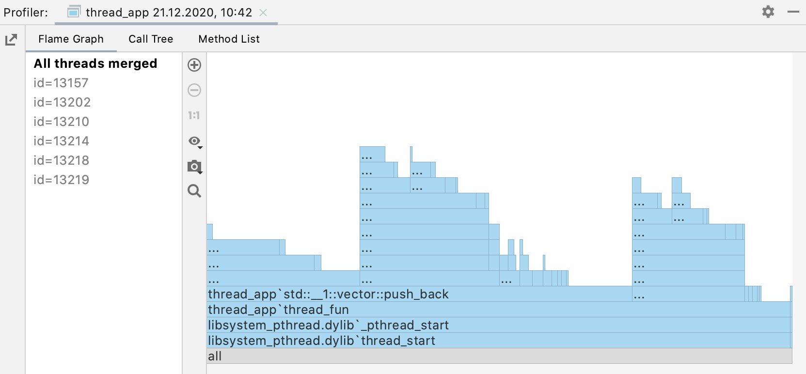

# Memory Management

在程式語言中，通常會有**記憶體管理 (memory management)** 系統。在二進位作業系統中，記憶裝置（記憶體、硬碟、光碟、軟碟等等）只會儲存 0 和 1，並藉由這兩個「符號」的陣列來表示資料，因此可視為這些裝置都是一列很長的小格子組成。

要知道，記憶體管理系統**僅為程式語言方便表達而設計**。在**真正**的程式中，只會執行：

+ **索取 (require)**：索取記憶體，通常會執行初始化來清理前面使用過的資料（全部變為 0），但是也可以不清理。若記憶體不足會引發錯誤，作業系統可以延緩索取。
+ **存放 (store)**：儲存資料到記憶體位置。
+ **載入 (load)**：從記憶體位置拿取資料。
+ **釋放 (release)**：歸還記憶體，資料通常就丟著。

接下來進入主題。如下圖所示，在記憶體分析器中，每個矩形都可視為一個短暫的執行區，稱為 stack。水平方向為時間的流逝，由左開始執行，到右結束程式。對 stack 裡的資料來說，它們僅存在於水平方向的一小部分，從建立到刪除，稱為該資料的**生命週期 (life cycle)**。最底下的矩形圖形涵蓋了整個水平方向的部分，可以視為其記憶體在程式執行過程中都占用著，習慣上會用**靜態 (static)** 來稱呼之。不過靜態一詞可指稱跨度多個 stack 間的生命週期。



在這個框架之外，某些資料可能會需要客製化的生命週期。這時候這些資料可以散落到記憶體中，而非如 stack 通常是在差不多時間索取記憶體，這個執行區稱為 heap。由於記憶體安全問題，stack 被設定了一些限制，所以必須仰賴 heap 來繞過限制。

+ 大小上限：由於通常會造成多項資料的建立，stack 被設定了大小上限，每種程式語言和不同作業系統框架下不一定相同。如 32 位元肯定比 64 位元限制更多，因為最多只有 4 GB 的裝置上限。
+ 堆疊上限：在**遞迴 (recursive)** 的設計之下，相同模式的 stack 可以被連堆疊，造成連續的記憶體消耗，因此設定了堆疊上限。不同的程式語言上限也不同。

以下是一個 Rust 程式的 stack 範例：

```rust
let a = 10;
{
    let b = 20;
    {
        let c = 30;
        println!("{}", c);
    }
    println!("{}", b);
}
println!("{}", a);
```

Rust 可以使用大括弧 `{}` 隨時在程式碼中開啟一個 stack，使用 `let` 關鍵字聲明 (declare) 的變數代表其所在的 stack。如變數 `a` 是在最外面，變數 `b` 是在裏層的 stack 內，以此類推。這些變數都會在所在的 stack 關閉時被**釋放**，釋放後的變數將會不可使用。

可以注意到的是，堆疊的子層的生命週期會比疊在的父層還短，所以子層也可以**載入**父層變數的資料。Rust 中也允許聲明相同的變數名稱，不過只是**遮擋 (shadow)** 前面的變數，並不會影響之前變數的生命週期，但是會取代之後的名稱引用。

而在控制流程中，由於聲明在其中的變數較無法處理，因此通常會將控制流程的區塊也認為是 stack。如下面範例中的變數 `i` 只能在迴圈中使用，而且每一次重複執行都視為不同的 `i`，其他聲明在迴圈中的變數亦是如此。

```rust
for i in 0..10 {
    let a = i * i;
    println!("{}", a);
}
```
